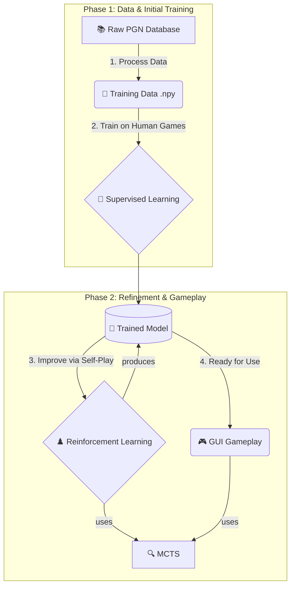

# ♟️ Chess AI Project

[](https://www.python.org/)
[](https://pytorch.org/)
[](LICENSE)
[]()

A **Chess AI** built with **PyTorch**, featuring both **Supervised Learning** and **Reinforcement Learning (Self-Play)**. Train, play, and improve the AI with Monte Carlo Tree Search (MCTS) and a deep neural network.

)

-----

## 🚀 Features

-   🧠 **Supervised Learning:** Train AI on historical PGN chess games.
-   ♟️ **Reinforcement Learning (Self-Play):** Improve AI through self-play using MCTS.
-   🔍 **Monte Carlo Tree Search (MCTS):** Efficient move selection during self-play and gameplay.
-   🎨 **Chess GUI:** Play against your AI with a simple graphical interface.
-   🗄️ **Data Processing Pipeline:** Convert raw PGN data into structured board states and move targets for neural network training.

-----

## 🧩 Implementation Details

### Neural Network (`utils/model.py`)

The AI uses a **deep convolutional network (`ChessModel`)** in PyTorch:

-   **Input:** 8×8×18 tensor (piece positions, side-to-move, castling rights, move counters)
-   **Architecture:**
    -   Initial convolutional layer
    -   12 residual blocks for feature extraction
    -   **Policy Head:** Outputs probabilities for 4672 possible moves (`log_softmax`)
    -   **Value Head:** Predicts game outcome in [-1, 1] (`tanh`)

### Monte Carlo Tree Search (MCTS) (`utils/mcts.py`)

-   🔹 **Selection:** Traverse nodes using UCB1-like formula (exploration + exploitation).
-   🔹 **Expansion:** Neural network predicts policy/value; expands leaf nodes with Dirichlet noise at root.
-   🔹 **Simulation (Implicit):** Value prediction acts as playout result; finished games use real outcomes.
-   🔹 **Backpropagation:** Update visit counts, total values, and mean action values; alternate negation for players.

💡 **Combination:** Neural network + MCTS allows the AI to learn from historical games and improve through self-play.

-----

## 📊 Visual Workflow

Here’s a high-level overview of the entire process from data to gameplay.



***

## 🗂️ Project Structure

```
MLdev/pytorchprojs/chess_ai/
├── config.py             # Global configuration settings
├── requirements.txt      # Python dependencies
├── README.md             # Project documentation
├── database/             # Raw PGN game data
│   └── lichess_db_standard_rated_2014-06.pgn.zst
├── game/                 # Game logic and GUI
│   ├── chess_gui.py      # Graphical interface
│   └── play_game.py      # Launch a game against AI
├── images/               # Game images/assets
├── models/               # Trained AI models
│   ├── rl/               # Reinforcement Learning models
│   └── supervised/       # Supervised Learning models
├── processed_data/       # Processed board states and outcomes
├── scripts/              # Training and utility scripts
└── utils/                # Helper modules

```

-----

## ⚙️ Installation

1.  **Clone the repository:**
    ```bash
    git clone <repository_url>
    cd MLdev/pytorchprojs/chess_ai
    ```
2.  **Create a virtual environment:**
    ```bash
    python -m venv venv

    # Windows
    .\venv\Scripts\activate

    # macOS/Linux
    source venv/bin/activate
    ```
3.  **Install dependencies:**
    ```bash
    pip install -r requirements.txt
    ```

---

## 🛠️ Configuration

All settings are in `config.py`:

```python
class GlobalConfig:
    DEVICE = "cuda"  # or "cpu"
    LEARNING_RATE_RL = 0.001
    LEARNING_RATE_SUPERVISED = 0.001
    PGN_FILE_PATH = "C:/.../database/lichess_db_standard_rated_2014-06.pgn.zst"
    PROCESSED_DATA_DIR = "C:/.../processed_data"
```

⚠️ Ensure absolute paths match your system.

---

## 🎯 Usage

1.  **Data Processing**
    ```bash
    python scripts/process_data.py
    ```
    Converts raw PGN files into training-ready `.npy` files.

2.  **Supervised Training**
    ```bash
    python scripts/supervised_train.py
    ```
    Trains the AI using processed data. Checkpoints are saved in `models/supervised/`.

3.  **Reinforcement Learning (Self-Play)**
    ```bash
    python scripts/rl_train.py
    ```
    AI plays against itself, improving policy and value networks. Models saved in `models/rl/`.

4.  **Play Against the AI**
    ```bash
    python game/play_game.py
    ```
    Launch the GUI and play against a trained model.

-----

## 📂 PGN Files

Place Lichess PGN files in `database/`.

Example: `database/lichess_db_standard_rated_2014-06.pgn.zst`

---

## ✅ Requirements

-   torch
-   python-chess
-   numpy
-   requests

Install all dependencies easily:

```bash
pip install -r requirements.txt
```

-----

## 💡 Tips

  - Use a **GPU** (e.g., RTX 4050) for significantly faster training.
  - Start with **supervised training** to get a strong base model, then fine-tune with **self-play RL**.
  - Keep the `processed_data` directory organized; each `.npy` chunk represents a batch of games.
